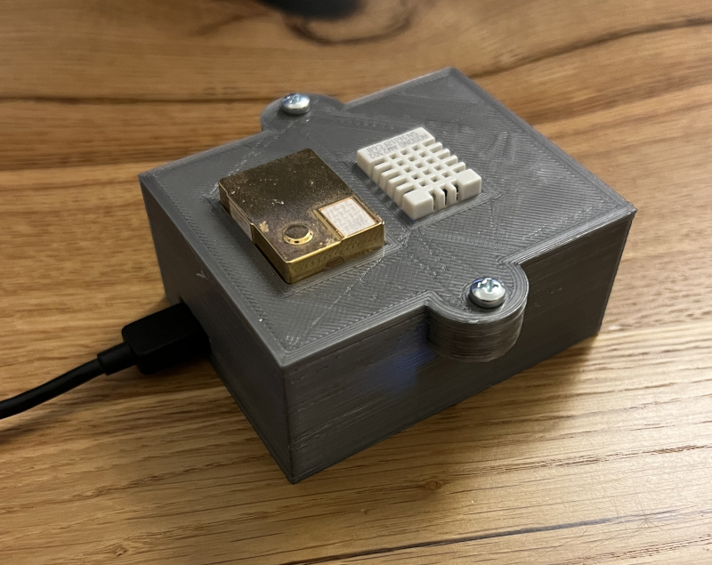

# Meteostation

Platformio project for ESP8266. 

**Used sensors:**
* MH-Z19 for CO2
* DHT22 for Tempreture & Humidity

**Features:**
* OpenTSDB for storing metrics
* Current time obtaining by NTP Client
* Web-based Wifi and TSDB configuration
* EEPROM storage for credentials

**Device configuration** 
WiFi and OpenTSDB credentials can be configured on the web interface:
http://device.ip/_ac

By default device in a WiFi AP mode.
Device SSID is "METEOSTATION-some digits"

**Device status** 
Normally device blinks several times per minute, when sending metrics to the database

If something went wrong, the device will blink continuously

**Build and monitor commands**

    pio run -t upload
    pio device monitor -b 115200

**Device case**
STL files for printing the case could be found in [case folder](case/)
